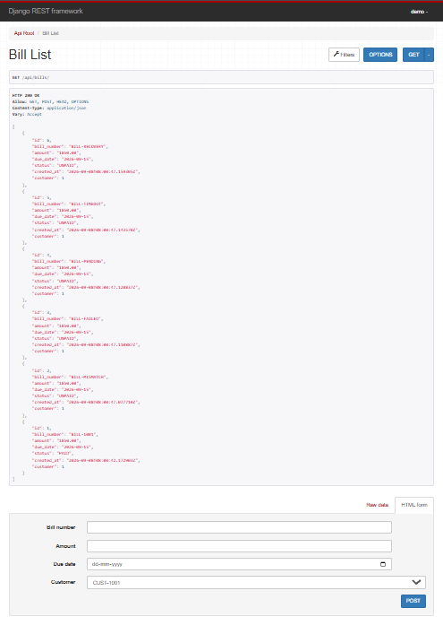
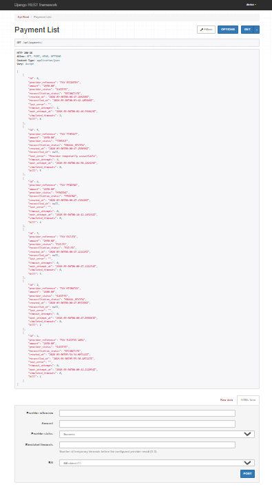
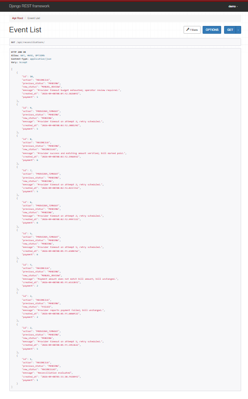
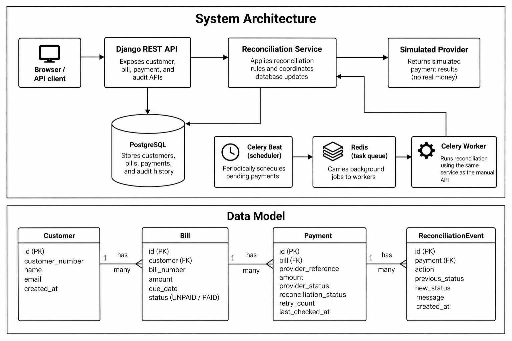

# UtilityPay Reconciliation Service

A Django REST API that resolves a common utility billing mismatch: a payment provider reports **SUCCESS**, but the corresponding bill is still **UNPAID**. UtilityPay checks the payment amount, updates the bill, and records the reconciliation decision.

This is an educational backend with simulated provider statuses. It does not transfer money or connect to a real payment gateway. The browser interface is Django REST Framework's browsable API, not a custom customer dashboard.

## Features

- Customer, bill, and payment APIs.
- Automatic reconciliation every 60 seconds through Celery Beat and workers.
- Manual reconciliation of individual payments.
- Atomic database updates and PostgreSQL row locks for concurrent reconciliation.
- Audit events for reconciliation status changes.
- JWT authentication for API clients and session login for browsers.
- Browser form CSRF protection and static assets served by WhiteNoise.
- Validation of positive bill/payment amounts and API protection against editing reconciled payment details.
- Docker Compose setup and automated regression tests.

## Technology

| Component | Technology |
|---|---|
| Application | Python 3.12, Django 5.1, Django REST Framework |
| Database | PostgreSQL 16 |
| Background processing | Celery 5.4, Redis 7 |
| Authentication | SimpleJWT and Django sessions |
| HTTP and static assets | Gunicorn and WhiteNoise |
| Testing | Pytest, pytest-django, Coverage.py for the optional local runner |
| Containers | Docker Compose |

Exact Python dependency versions are in [requirements.txt](requirements.txt).

## Quick start with Docker

Install Docker Desktop with Linux container support and start it. Run the following commands from the project root, where `docker-compose.yml` is located.

### 1. Open the project folder

For this Windows workspace:

```powershell
cd "C:\Users\gagan\OneDrive\Desktop\utilitypay_project"
```

If you downloaded the project elsewhere, use that directory instead. Copy only the commands, without the `PS C:\...>` terminal prompt.

### 2. Configure the environment

Create `.env` only if it does not already exist:

```powershell
if (!(Test-Path .env)) { Copy-Item .env.example .env }
```

Generate a secret using Docker:

```powershell
docker run --rm python:3.12-slim python -c "import secrets; print(secrets.token_urlsafe(48))"
```

Copy the generated value into `DJANGO_SECRET_KEY` in `.env`, replacing `change-me`. Keep `.env` private; it is excluded from Git and Docker build context. The remaining example values work for the local Compose setup.

### 3. Start the application

```powershell
docker compose up -d --build
docker compose logs -f web
```

Web startup applies migrations, seeds the demo account and records, collects static files, and starts Gunicorn on port **8000**. Wait for Gunicorn to start before opening the browser. Press `Ctrl+C` to stop following logs; the detached containers keep running.

### 4. Log in through the browser

Open **[Browser login](http://localhost:8000/api-auth/login/?next=/api/)**.

| Field | Demo value |
|---|---|
| Username | `demo` |
| Password | `demo12345` |

After login, the API root should show **HTTP 200 OK** and links to the resources below.

| Page | URL |
|---|---|
| API root | http://localhost:8000/api/ |
| Customers | http://localhost:8000/api/customers/ |
| Bills | http://localhost:8000/api/bills/ |
| Payments | http://localhost:8000/api/payments/ |
| Reconciliation history | http://localhost:8000/api/reconciliations/ |
| Public health check | http://localhost:8000/health/ |

The demo account is for development. Web startup resets its password to the value above. Existing demo bill/payment records are reused rather than reset.

## Demo workflow

On the first startup, the seed creates:

| Record | Initial value |
|---|---|
| Customer | `CUST-1001` |
| Bill | `BILL-1001`, amount `1850.00`, status `UNPAID` |
| Payment | `PAY-SUCCESS-1001`, amount `1850.00`, provider status `SUCCESS` |

Within a scheduling cycle, Celery queues the pending payment. Successful reconciliation changes its status to `RECONCILED`, marks the bill `PAID`, and creates an audit event. The bill may already be paid when you first open it.

Repeated reconciliation of an unchanged outcome does not add another audit event. A corrected failed or manual-review payment can be evaluated again.

## Screenshots

The following screenshots show the seeded demo payment after reconciliation.

### Paid bill

The bill for 1850.00 is marked PAID after successful reconciliation.



### Reconciled payment

The provider reports SUCCESS, and the application records the payment
as RECONCILED after checking the amount.



### Reconciliation history

The audit event records the payment's status change and the reason
for the decision.



## Architecture and data



### Reconciliation rules

| Condition | Payment result | Bill effect |
|---|---|---|
| Provider `SUCCESS`, matching amount | `RECONCILED` | Marks bill `PAID` |
| Provider `SUCCESS`, mismatched amount | `MANUAL_REVIEW` | No change |
| Provider `FAILED` | `FAILED` | No change |
| Provider `PENDING` | No status change | No change |
| Provider `TIMEOUT` | Saves diagnostic; manual API returns 503 | No change |
| Payment already `RECONCILED` | No change | No change |

Workers retry timeouts with backoff, up to three retries per task. A payment that remains pending can be queued again by later Beat cycles. Provider states are stored simulated values; retries do not contact an external provider or automatically change those values.

Bill amounts must be greater than zero, enforced by the API and a database constraint. Payment amounts must be positive through the API. Reconciled payments reject API changes to their bill, amount, provider reference, and provider status; unchanged updates are allowed.

## API reference

Resource endpoints support list/create at the collection URL and retrieve/update/delete at `/{id}/`, except reconciliation events, which are read-only.

| Method | Endpoint | Purpose |
|---|---|---|
| POST | `/api/auth/token/` | Obtain access and refresh tokens |
| POST | `/api/auth/token/refresh/` | Refresh an access token |
| GET, POST | `/api/customers/` | List/create customers |
| GET, PUT, PATCH, DELETE | `/api/customers/{id}/` | Manage a customer |
| GET, POST | `/api/bills/` | List/create bills |
| GET, PUT, PATCH, DELETE | `/api/bills/{id}/` | Manage a bill |
| GET, POST | `/api/payments/` | List/create payments |
| GET, PUT, PATCH, DELETE | `/api/payments/{id}/` | Manage a payment |
| POST | `/api/payments/{id}/reconcile/` | Reconcile immediately |
| GET | `/api/reconciliations/` | List audit events |
| GET | `/api/reconciliations/{id}/` | Read an audit event |
| GET | `/health/` | Basic application response check |

All resource endpoints require authentication. Bill status and payment reconciliation fields are controlled by the service. Supported filters include bill `status`/`customer`, payment `provider_status`/`reconciliation_status`/`bill`, and event `payment`/`action`.

### PowerShell example

Log in and view records:

```powershell
$login = Invoke-RestMethod -Uri "http://localhost:8000/api/auth/token/" -Method Post -ContentType "application/json" -Body '{"username":"demo","password":"demo12345"}'
$headers = @{ Authorization = "Bearer $($login.access)" }

Invoke-RestMethod -Uri "http://localhost:8000/api/bills/" -Headers $headers
Invoke-RestMethod -Uri "http://localhost:8000/api/payments/" -Headers $headers
Invoke-RestMethod -Uri "http://localhost:8000/api/reconciliations/" -Headers $headers
```

Manually reconcile a payment, replacing `1` with its actual ID:

```powershell
Invoke-RestMethod -Uri "http://localhost:8000/api/payments/1/reconcile/" -Method Post -Headers $headers
```

Access tokens last 30 minutes; refresh tokens last one day. A PowerShell token does not sign your browser in. Use browser login separately. Changing the application secret invalidates existing JWT tokens.

## Configuration

| Variable | Purpose |
|---|---|
| `DJANGO_SECRET_KEY` | Secret for Django and JWT signing; replace the example value |
| `DJANGO_DEBUG` | `1` enables development debug mode |
| `POSTGRES_DB` | Database name |
| `POSTGRES_USER` | Database user |
| `POSTGRES_PASSWORD` | Database password |
| `POSTGRES_HOST` | `db` inside the Compose network |
| `POSTGRES_PORT` | PostgreSQL port, normally `5432` |
| `REDIS_URL` | Queue/result backend, normally `redis://redis:6379/0` |

Compose loads `.env` into the containers. Direct local Python execution does not automatically load this file; export variables or use the provided local test runner.

After changing `.env`:

```powershell
docker compose up -d --force-recreate
```

After changing application code or dependencies:

```powershell
docker compose up -d --build
```

## Testing

### Run the full suite in Docker

```powershell
docker compose exec web pytest -q
```

The latest verified Docker run passed **60 tests**, including browser login/logout and CSRF checks. Tests cover reconciliation outcomes, idempotency, validation, JWT access, audit APIs, rollback, and concurrent PostgreSQL reconciliation. Pytest uses a separate test database.

See [TEST_REPORT.md](TEST_REPORT.md) for the earlier 58-test fix verification and coverage scope. The later browser-enabled run is recorded in `test-results/browser-suite.txt` when that local artifact is available.

### Optional isolated stack and coverage

With Python 3.12 installed:

```powershell
python -m venv .venv
.venv\Scripts\python.exe -m pip install -r requirements.txt coverage
docker compose -p utilitypay-test -f compose.test.yml up -d --build
powershell -ExecutionPolicy Bypass -File run-tests.ps1
```

This stack uses localhost ports **55432** for PostgreSQL, **56379** for Redis, and **58000** for HTTP. Test output, JUnit XML, and coverage reports are written under `test-results/`. The deployment check records development-setting warnings separately from pytest results.

After web startup, run the scheduled reconciliation smoke test against the isolated stack:

```powershell
.venv\Scripts\python.exe smoke-test.py
```

To check browser-style cookie login and CSS against the normal application on port 8000:

```powershell
.venv\Scripts\python.exe browser-smoke-test.py
```

The scheduled smoke test creates demo records in the isolated database. Stop its services when finished:

```powershell
docker compose -p utilitypay-test -f compose.test.yml stop
```

## Troubleshooting

| Symptom | What to do |
|---|---|
| `no configuration file provided: not found` | Change into the project root before running Docker Compose. |
| `/api/` shows `401 Unauthorized` | Click **Log in** or open `/api-auth/login/?next=/api/`. API clients must send a Bearer token. |
| API looks unstyled | Rebuild with `docker compose up -d --build`, inspect web startup logs, then hard-refresh with `Ctrl+F5`. |
| `InsecureKeyLengthWarning` | Replace `DJANGO_SECRET_KEY` with a generated secret, recreate services, and log in again. |
| `service "web" is not running` | Start the stack and inspect `docker compose logs web`. Wait for migrations and Gunicorn startup. |
| Bill is already `PAID` | The background worker may have reconciled it before you opened the page; seed data is reused on restart. |
| Bill amount migration fails | Correct existing zero/negative bills before applying `0002_bill_amount_positive`; the migration does not rewrite them. |

Inspect service state and logs:

```powershell
docker compose ps
docker compose logs --tail 50 web worker beat
```

Stop the normal application:

```powershell
docker compose down
```

The named PostgreSQL volume survives this command, preserving application data.

